<!-- HERO BANNER -->
<a href="https://github.com/sandeepmothukuri">
  
</a>

<!-- AUTO-UPDATED-SNAKE START -->
<div align="center">
  
  <picture>
    <source media="(prefers-color-scheme: dark)" srcset="https://raw.githubusercontent.com/sandeepmothukuri/sandeepmothukuri/output/github-snake-dark.svg">
    <source media="(prefers-color-scheme: light)" srcset="https://raw.githubusercontent.com/sandeepmothukuri/sandeepmothukuri/output/github-snake.svg">
    
  </picture>
  
</div>
<!-- AUTO-UPDATED-SNAKE END -->

<!-- STATUS BAR -->
<p align="center">
  
  
  
  <a href="mailto:sandeep.mothukuris@gmail.com?subject=SOC%20Role%20%E2%80%94%20Opportunity"></a>
  <!-- STATUS START -->
  
  
<!-- STATUS END -->
</p>

<!-- AT A GLANCE -->
<p align="center">
  
  
  
  
  <!-- PUBLIC-REPOS START -->
  
<!-- PUBLIC-REPOS END -->
  
  <!-- DAYS-COUNTER START -->
    
<!-- DAYS-COUNTER END -->
  <!-- PROFILE-VIEWS START -->
  
  
  
<!-- PROFILE-VIEWS END -->
</p>

<!-- TYPING ANIMATION -->
<p align="center">
  <a href="https://github.com/sandeepmothukuri">
    
  </a>
</p>

<p align="center">
<!-- GREETING START -->
<sub><b>👋 Good afternoon!</b> &nbsp;·&nbsp; </sub>
<!-- GREETING END -->
</p>

<!-- SOC VISUAL INTERFACE START -->
<p align="center">
  
</p>
<!-- SOC VISUAL INTERFACE END -->

<!-- SOC INCIDENT PIPELINE START -->
<p align="center">
  
</p>
<!-- SOC INCIDENT PIPELINE END -->

<p align="center"></p>

## 🛡️ About

**Senior SOC Analyst (L3)** with **5+ years** across enterprise and MSSP environments. I'm the escalation point teams reach when the alert is real, the clock is loud, and the next call decides whether containment beats compromise. I lead with **risk and business impact**, not severity scores — and I document every move so the next analyst, manager, or auditor can follow the trail.

Outside of work I build **open-source SOC labs** that mirror enterprise stacks, so analysts can train on Splunk / QRadar / Sentinel / CrowdStrike-class tooling without the licensing wall.

## 🎯 What I Do

| Area | Detail |
|---|---|
| **Incident Response** | End-to-end IR — detection → investigation → containment → recovery → RCA |
| **Threat Hunting** | Hypothesis-driven hunts, Sigma rule authoring, behaviour-based detection |
| **Detection Engineering** | Custom Splunk / QRadar / Wazuh rules, tuning, false-positive reduction |
| **SOAR & Automation** | Playbook design, alert enrichment, Python automation |
| **Cloud & XDR** | Microsoft Sentinel, Defender XDR, CrowdStrike Falcon investigations |
| **Lab Building** | Open-source SOC labs that mirror enterprise stacks — free for the community |

## 🧭 Currently focused

- 🔭 **Building** — AI-augmented SOC automation: LLM-assisted alert triage, autonomous detection pipelines, agentic IR playbooks (CrewAI + Ollama)
- 🌱 **Learning** — Sigma rule authoring at scale · adversary emulation with Caldera · detection-as-code with CI/CD validation
- 🧪 **Writing** — Open-source SOC labs others can clone in 15 min (see Featured Labs below)
- 🎤 **Discussing** — detection engineering, SOAR design, the false-positive economy in modern SOCs

## 💬 Ask me about

SIEM tuning · MITRE ATT&CK mapping · incident response playbooks · SOC home labs · L1 → L3 career progression · interview prep for SOC roles · transitioning from MSSP to in-house SOC · open-source SOAR vs. commercial vendors

## 🧰 Stack — cybersecurity tooling

**SIEM / XDR / EDR**

<p align="left">
  
  
  
  
  
  
  
  
</p>

**DFIR & Threat Intel**

<p align="left">
  
  
  
  
  
  
  
  
  
</p>

**Detection Engineering & Frameworks**

<p align="left">
  
  
  
  
  
  
  
  
</p>

**Offensive Security & Pen-Testing**

<p align="left">
  
  
  
  
  
  
  
</p>

**SOAR & Scripting**

<p align="left">
  
  
  
  
  
</p>

<!-- SOC TELEMETRY STREAM START -->
<p align="center">
  
</p>
<!-- SOC TELEMETRY STREAM END -->

## 🧪 Featured Labs

<p align="center">
<!-- LAB-AGGREGATE START -->
          
<!-- LAB-AGGREGATE END -->
</p>

<!-- PORTFOLIO-PULSE START -->
<p align="center">
<sub>📡 <b>Portfolio Pulse</b> · last 7 days</sub><br>
          
</p>
<!-- PORTFOLIO-PULSE END -->

<!-- TOP-REPO START -->
<p align="center">
<sub>🏆 <b>Top repositories this week</b> · ranked by views and clones</sub><br>
<a href="https://github.com/sandeepmothukuri/advanced-soc-lab-v2.0"></a>  <a href="https://github.com/sandeepmothukuri/Enterprise-Detection-Engineering-SOC-Lab"></a>  <a href="https://github.com/sandeepmothukuri/soc-lab-free"></a>
</p>
<!-- TOP-REPO END -->

<table>
<tr>
<td width="50%" valign="top">

### 🔐 [Enterprise-Detection-Engineering-SOC-Lab](https://github.com/sandeepmothukuri/Enterprise-Detection-Engineering-SOC-Lab)
12-tool SOC lab — OpenSearch · Suricata · Zeek · MISP · Caldera · Velociraptor + AI agents. Docker Compose, MITRE ATT&CK v14, 15 built-in detection rules.
<!-- REPO-METRICS:Enterprise-Detection-Engineering-SOC-Lab START -->
<sub>   </sub>
<!-- REPO-METRICS:Enterprise-Detection-Engineering-SOC-Lab END -->

</td>
<td width="50%" valign="top">

### 🤖 [ai-soc-lab](https://github.com/sandeepmothukuri/ai-soc-lab)
AI-augmented open-source SOC — Wazuh + TheHive + Shuffle + MISP + Ollama (LLaMA3) for automated alert triage.
<a href="https://codespaces.new/sandeepmothukuri/ai-soc-lab?quickstart=1"></a>
<!-- REPO-METRICS:ai-soc-lab START -->
<sub>   </sub>
<!-- REPO-METRICS:ai-soc-lab END -->

</td>
</tr>
<tr>
<td width="50%" valign="top">

### 🆓 [soc-lab-free](https://github.com/sandeepmothukuri/soc-lab-free)
100% free SOC lab — OpenVAS, Wazuh, pfSense, Proxmox Mail, Lynis replacing Nessus, Splunk, Netskope, Mimecast.
<!-- REPO-METRICS:soc-lab-free START -->
<sub>   </sub>
<!-- REPO-METRICS:soc-lab-free END -->

</td>
<td width="50%" valign="top">

### 🛡️ [soc-lab](https://github.com/sandeepmothukuri/soc-lab)
SOC analyst home lab — Wazuh SIEM, Sysmon, brute-force detection, MITRE ATT&CK mapping, IR workflow.
<!-- REPO-METRICS:soc-lab START -->
<sub>   </sub>
<!-- REPO-METRICS:soc-lab END -->

</td>
</tr>
<tr>
<td width="50%" valign="top">

### 🔬 [soc-threat-hunting-lab](https://github.com/sandeepmothukuri/soc-threat-hunting-lab)
Advanced threat detection lab — Zeek · RITA · Arkime · Velociraptor · OSQuery · MISP · TheHive · Shuffle.
<!-- REPO-METRICS:soc-threat-hunting-lab START -->
<sub>   </sub>
<!-- REPO-METRICS:soc-threat-hunting-lab END -->

</td>
<td width="50%" valign="top">

### 🌀 [Autonomous-SOC-Lab](https://github.com/sandeepmothukuri/Autonomous-SOC-Lab)
Autonomous SOC with AI-driven detection, automated response, and self-healing playbooks.
<!-- REPO-METRICS:Autonomous-SOC-Lab START -->
<sub>   </sub>
<!-- REPO-METRICS:Autonomous-SOC-Lab END -->

</td>
</tr>
<tr>
<td width="50%" valign="top">

### 🔵 [cyberblue](https://github.com/sandeepmothukuri/cyberblue)
Containerised blue-team platform — Wazuh SIEM · Suricata · Zeek · MISP · TheHive · SOAR. Published at cybertechnology.in.
<!-- REPO-METRICS:cyberblue START -->
<sub>   </sub>
<!-- REPO-METRICS:cyberblue END -->

</td>
<td width="50%" valign="top">

### 🛡️ [PromptSentinel](https://github.com/sandeepmothukuri/PromptSentinel)
Enterprise-grade prompt injection detection and AI firewall — 22 detectors, OWASP LLM Top 10, SARIF/SIEM output, FastAPI + Docker.
<!-- REPO-METRICS:PromptSentinel START -->
<sub>   </sub>
<!-- REPO-METRICS:PromptSentinel END -->

</td>
</tr>
</table>

<!-- SOC DETECTION PIPELINE START -->
<p align="center">
  
</p>
<!-- SOC DETECTION PIPELINE END -->

## 🧬 Detection Engineering — sample work

A SOC analyst is judged on the quality of detections they ship, not the tools they list. Two examples below.

**Sigma rule — encoded PowerShell with obfuscation indicators**

```yaml
title: Suspicious Encoded PowerShell Execution
id: 7c1e9b34-2f4a-4e6d-9a1c-1d5b7c0a4e91
status: stable
description: Detects PowerShell launched with base64-encoded command lines, a common
  technique used by malware loaders and red teams to evade plaintext detection.
references:
  - https://attack.mitre.org/techniques/T1059/001/
logsource:
  product: windows
  service: sysmon
detection:
  selection:
    EventID: 1
    Image|endswith: '\powershell.exe'
  encoded:
    CommandLine|contains:
      - '-enc'
      - '-EncodedCommand'
      - 'FromBase64String'
  condition: selection and encoded
falsepositives:
  - Admin scripts that legitimately use encoded commands (rare; pin to known hashes).
level: high
tags:
  - attack.execution
  - attack.t1059.001
```

**Splunk SPL — lateral movement via SMB admin shares**

```spl
index=wineventlog EventCode=5140
  ShareName IN ("\\\\*\\ADMIN$", "\\\\*\\C$")
  AccessMask="0x1"
| stats dc(ComputerName) as host_count
        values(ComputerName) as hosts
        values(IpAddress) as src_ips
        count
  by Account_Name
| where host_count >= 5 AND count >= 10
| sort - host_count
| eval risk_score = host_count * 10 + (count / 5)
```

> Triggers when one account touches `ADMIN$` / `C$` on **5+ distinct hosts** within the search window — classic post-exploitation lateral movement (PsExec, Impacket, Cobalt Strike `psexec_psh`).

## 🧯 Detection Case Studies

<sub>A curated cross-section of live detection rules from across my open-source labs — what each rule catches, why it matters, and a link to the YAML. Every row is auto-generated from the actual rule files; click any source link to read the full logic.</sub>

<!-- DETECTION-CASESTUDIES START -->
<details open>
<summary><b>📋 Detection case studies</b> &mdash; 10 representative rules from my live detection portfolio</summary>

| Technique | Tactic | What the rule catches | Severity | Source |
|---|---|---|---|---|
| **T1003.001** | Credential Access | LSASS process memory dumping | Critical | [advanced-soc-lab-v2.0](https://github.com/sandeepmothukuri/advanced-soc-lab-v2.0/blob/main/config/elastalert2/rules/T1003_credential_dump.yml) |
| **T1110** | Credential Access | Password brute-force / spray | High | [advanced-soc-lab-v2.0](https://github.com/sandeepmothukuri/advanced-soc-lab-v2.0/blob/main/config/elastalert2/rules/T1110_brute_force.yml) |
| **T1059.001** | Execution | Encoded / obfuscated PowerShell execution | Critical | [advanced-soc-lab-v2.0](https://github.com/sandeepmothukuri/advanced-soc-lab-v2.0/blob/main/config/elastalert2/rules/T1059_powershell.yml) |
| **T1557.001** | Credential Access | Adversary-in-the-middle (LLMNR / NBT-NS / mDNS poisoning) | High | [advanced-soc-lab-v2.0](https://github.com/sandeepmothukuri/advanced-soc-lab-v2.0/blob/main/config/elastalert2/rules/T1557_responder.yml) |
| **T1071** | Command & Control | Application-layer C2 beaconing | Critical | [advanced-soc-lab-v2.0](https://github.com/sandeepmothukuri/advanced-soc-lab-v2.0/blob/main/config/elastalert2/rules/network_c2_beacon.yml) |
| **T1078.004** | Initial Access | Detects two successful interactive sign-ins for the same user from locations whose great-circle distance ca… | High | [sentinel-detection-engine](https://github.com/sandeepmothukuri/sentinel-detection-engine/blob/main/Detections/EntraID_ImpossibleTravel.yaml) |
| **T1621** | Credential Access | Detects 5+ failed MFA prompts followed by a successful sign-in for the same user within 30 minutes. | High | [sentinel-detection-engine](https://github.com/sandeepmothukuri/sentinel-detection-engine/blob/main/Detections/EntraID_MFAFatigue.yaml) |
| **T1213.002** | Collection | Detects users downloading > 200 files within 1 hour from SharePoint or OneDrive, with comparison to the use… | Medium | [sentinel-detection-engine](https://github.com/sandeepmothukuri/sentinel-detection-engine/blob/main/Detections/M365_MassSharePointDownload.yaml) |
| **T1071** | Command & Control | Detects C2 beaconing behavior based on regular interval connections to external hosts. | Medium | [soc-threat-hunting-lab](https://github.com/sandeepmothukuri/soc-threat-hunting-lab/blob/main/08-integrations/sigma-rules/c2-beaconing.yml) |
| **T1071.004** | Command & Control | Detects DNS tunneling by identifying unusually long subdomain queries or high query frequency to the same d… | Medium | [soc-threat-hunting-lab](https://github.com/sandeepmothukuri/soc-threat-hunting-lab/blob/main/08-integrations/sigma-rules/dns-tunneling.yml) |

<sub>Auto-generated from the YAML in each lab — refreshes weekly via `.github/workflows/detection-portfolio.yml`. Click any rule link to read the full detection logic.</sub>
</details>
<!-- DETECTION-CASESTUDIES END -->

### ⏱️ Detection trigger thresholds

<sub>Configured detection windows for frequency-based rules in my labs — i.e. how many events must occur in what time span before each rule fires. Parsed from each rule's `num_events` and `timeframe` YAML fields; the values here are the same ones the live rules use in production.</sub>

<!-- DETECTION-TRIGGERS START -->
| Rule | Type | Trigger | Worst-case latency | Source |
|---|---|---|---|---|
| T1003.001 — LSASS Credential Dumping | `any` | Fires on first match (no time aggregation) | near real-time | [T1003_credential_dump.yml](https://github.com/sandeepmothukuri/advanced-soc-lab-v2.0/blob/main/config/elastalert2/rules/T1003_credential_dump.yml) |
| T1110 — Brute Force Authentication Attack | `frequency` | **10 events in 5m** | ≤ 5m | [T1110_brute_force.yml](https://github.com/sandeepmothukuri/advanced-soc-lab-v2.0/blob/main/config/elastalert2/rules/T1110_brute_force.yml) |
| T1059.001 — Suspicious Encoded PowerShell | `any` | Fires on first match (no time aggregation) | near real-time | [T1059_powershell.yml](https://github.com/sandeepmothukuri/advanced-soc-lab-v2.0/blob/main/config/elastalert2/rules/T1059_powershell.yml) |
| T1557 — LLMNR/NBT-NS Poisoning (Responder) | `any` | Fires on first match (no time aggregation) | near real-time | [T1557_responder.yml](https://github.com/sandeepmothukuri/advanced-soc-lab-v2.0/blob/main/config/elastalert2/rules/T1557_responder.yml) |
| T1071 — C2 Beacon Detected (Suricata) | `any` | Fires on first match (no time aggregation) | near real-time | [network_c2_beacon.yml](https://github.com/sandeepmothukuri/advanced-soc-lab-v2.0/blob/main/config/elastalert2/rules/network_c2_beacon.yml) |
| Entra ID - Impossible Travel Between Sign-Ins | `scheduled-query` | KQL polled every 1h | ≤ 60m | [EntraID_ImpossibleTravel.yaml](https://github.com/sandeepmothukuri/sentinel-detection-engine/blob/main/Detections/EntraID_ImpossibleTravel.yaml) |
| Entra ID - MFA Fatigue Followed by Success | `scheduled-query` | KQL polled every 30m | ≤ 30m | [EntraID_MFAFatigue.yaml](https://github.com/sandeepmothukuri/sentinel-detection-engine/blob/main/Detections/EntraID_MFAFatigue.yaml) |
| M365 - Mass SharePoint / OneDrive Download | `scheduled-query` | KQL polled every 1h | ≤ 60m | [M365_MassSharePointDownload.yaml](https://github.com/sandeepmothukuri/sentinel-detection-engine/blob/main/Detections/M365_MassSharePointDownload.yaml) |
| C2 Beaconing via Regular Network Connection | `sigma` | Sigma — backend-defined (Splunk/QRadar/Elastic timing) | backend-dependent | [c2-beaconing.yml](https://github.com/sandeepmothukuri/soc-threat-hunting-lab/blob/main/08-integrations/sigma-rules/c2-beaconing.yml) |
| DNS Tunneling via Long Subdomain Queries | `sigma` | Sigma — backend-defined (Splunk/QRadar/Elastic timing) | backend-dependent | [dns-tunneling.yml](https://github.com/sandeepmothukuri/soc-threat-hunting-lab/blob/main/08-integrations/sigma-rules/dns-tunneling.yml) |

<sub>Latency = the rule's own detection window (parsed from `timeframe`, `queryFrequency`, or `type`). Portfolio spread: 1–60 minutes worst-case. These are configured windows, not measured end-to-end times — click any source link to verify the raw values.</sub>
<!-- DETECTION-TRIGGERS END -->

## 🔐 Certifications

<p align="left">
  
  
  
  
  
  
  
  
</p>

<sub>Cert order: senior/specialty first, foundational at the end. Update if you hold different titles — e.g. CSAP, GSEC, OSCP, AZ-500, AWS Security.</sub>

## 📊 Live GitHub Stats

<p align="center">
  
  
</p>

<p align="center">
  
  
</p>

<p align="center">
  
</p>

<p align="center">
  
</p>

## 🌐 cybertechnology.in — Live Site Preview

<p align="center">
  <a href="https://cybertechnology.in" title="Open cybertechnology.in in a new tab">
    
  </a>
</p>

<p align="center">
  <a href="https://cybertechnology.in"></a>
  
  
</p>

<p align="center">
  <sub>📡 Personal lab + blog covering SOC operations, detection engineering, threat hunting walkthroughs, and open-source security tooling. Screenshot refreshes automatically — click to visit.</sub>
</p>


## 📡 SOC Pulse — live

Auto-refreshed daily by GitHub Actions. CVE feed from NIST NVD; threat headlines from public security RSS sources.

<!-- CVE-OF-THE-WEEK-START -->
### 🚨 Today's Top Critical CVE

| Field | Value |
|---|---|
| **CVE ID** | [`CVE-2026-81735`](https://nvd.nist.gov/vuln/detail/CVE-2026-81735) |
| **CVSS v3.1** | `10.0` (CRITICAL) |
| **Vector** | `CVSS:3.1/AV:N/AC:L/PR:N/UI:N/S:C/C:H/I:H/A:H` |
| **Published** | 2026-08-27 |

> startServer.ts in the mcp-http-server package of UI-TARS-desktop defaulted its listen address to '::' when no host was given, so startSseAndStreamableHttpMcpServer bound the Streamable HTTP and SSE MCP transports to every interface, and its authentication middleware was optional: middlewares are applied only when a caller supplies them. The @agent-infra/mcp-server-commands and …

_Source: [NIST NVD](https://nvd.nist.gov/). Last check: 2026-08-29 14:55 UTC. Auto-refreshed daily by [`cve-of-the-week.yml`](.github/workflows/cve-of-the-week.yml)._
<!-- CVE-OF-THE-WEEK-END -->

<!-- SECURITY-NEWS-START -->
### 📰 Threat Headlines

_Last refresh: 2026-08-30 14:14 UTC_

**The Hacker News**

- [TerminalFix Uses Fake Cloudflare CAPTCHAs to Deploy Reverse-Tunnel Backdoor](https://thehackernews.com/2026/08/terminalfix-uses-fake-cloudflare.html)
- [Five Critical WordPress Plugin and Theme Flaws Enable Site Takeover or RCE](https://thehackernews.com/2026/08/five-critical-wordpress-plugin-and.html)
- [Berlin Refuses to Pay Hackers Who Stole Data From the City's State Network](https://thehackernews.com/2026/08/berlin-refuses-to-pay-hackers-who-stole.html)
- [Cosmos EVM Flaw Exploited After Cosmos Labs Knew Every Blockchain Running It Was Vulnerable](https://thehackernews.com/2026/08/cosmos-evm-flaw-exploited-after-cosmos.html)

**BleepingComputer**

- [Anthropic is cutting Claude Code's current weekly limits by 17%](https://www.bleepingcomputer.com/news/artificial-intelligence/anthropic-is-cutting-claude-codes-current-weekly-limits-by-17-percent/)
- [Brave browser adds email aliases to help users evade tracking](https://www.bleepingcomputer.com/news/security/brave-browser-adds-email-aliases-to-help-users-evade-tracking/)
- [McKesson discloses breach after ShinyHunters claims patient data theft](https://www.bleepingcomputer.com/news/security/mckesson-discloses-breach-after-shinyhunters-claims-patient-data-theft/)
- [PaperCut releases second emergency patch for exploited flaws](https://www.bleepingcomputer.com/news/security/papercut-releases-second-emergency-patch-for-exploited-flaws/)

**Krebs on Security**

- [Two Alleged &#8216;TeamPCP&#8217; Hackers Arrested in Australia](https://krebsonsecurity.com/2026/08/two-alleged-teampcp-hackers-arrested-in-australia/)
- [Who&#8217;s Tracking You? Use This New Service to Find Out](https://krebsonsecurity.com/2026/08/whos-tracking-you-use-this-new-service-to-find-out/)
- [Microsoft Plugs Nearly 400 Security Holes](https://krebsonsecurity.com/2026/08/microsoft-plugs-nearly-400-security-holes/)
- [Canadian Man Pleads Guilty in Snowflake Extortions](https://krebsonsecurity.com/2026/08/canadian-man-pleads-guilty-in-snowflake-extortions/)

> Headlines pulled from public RSS feeds. Not endorsements — just situational awareness.
<!-- SECURITY-NEWS-END -->

## 🌍 Quick facts

| | |
|---|---|
| **Role** | Senior SOC Analyst (L3) |
| **Experience** | 5+ years (enterprise + MSSP) |
| **Specialties** | IR · Detection Engineering · Threat Hunting · Cloud XDR |
| **Open to** | Senior SOC Analyst · L3 · Detection Engineer · Threat Hunter |
| **Location preference** | UK / EU / Remote |
| **Availability** | Open to conversations now |
| **Languages** | English · Telugu · Hindi |
| **Website** | [cybertechnology.in](https://cybertechnology.in) |
| **Email** | [sandeep.mothukuris@gmail.com](mailto:sandeep.mothukuris@gmail.com) |
| **LinkedIn** | [sandeepmothukuri](https://www.linkedin.com/in/sandeepmothukuri) |

## 💼 Hiring me?

I'm actively open to **Senior SOC Analyst / L3 / Detection Engineer / Threat Hunter** roles. Remote-friendly, UK/EU preferred but happy to talk about anywhere with reasonable time-zone overlap.

📧 **Fastest way to reach me:** [sandeep.mothukuris@gmail.com](mailto:sandeep.mothukuris@gmail.com?subject=SOC%20Role%20%E2%80%94%20Opportunity)
🔗 Or send a LinkedIn message: [linkedin.com/in/sandeepmothukuri](https://www.linkedin.com/in/sandeepmothukuri)

## 📨 Contact

<p align="left">
  <a href="https://cybertechnology.in"></a>
  <a href="https://www.linkedin.com/in/sandeepmothukuri"></a>
  <a href="mailto:sandeep.mothukuris@gmail.com"></a>
</p>

📧 **Fastest way to reach me:** [sandeep.mothukuris@gmail.com](mailto:sandeep.mothukuris@gmail.com?subject=SOC%20Role%20%E2%80%94%20Opportunity) — typical reply within 24h.

---

<p align="center"><sub>⭐ If a lab or write-up helped you, a star helps other SOC analysts find this work.</sub></p>
<p align="center"><sub>Released under the <a href="LICENSE">MIT License</a>. © 2026 Sandeep Mothukuri.</sub></p>

