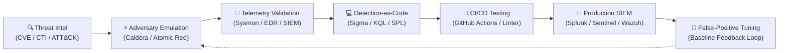

<!-- HERO BANNER -->
<a href="https://github.com/sandeepmothukuri">
  
</a>

<!-- AUTO-UPDATED-SNAKE START -->
<div align="center">
  
  <picture>
    <source media="(prefers-color-scheme: dark)" srcset="https://raw.githubusercontent.com/sandeepmothukuri/sandeepmothukuri/output/github-snake-dark.svg">
    <source media="(prefers-color-scheme: light)" srcset="https://raw.githubusercontent.com/sandeepmothukuri/sandeepmothukuri/output/github-snake.svg">
    
  </picture>
  
</div>
<!-- AUTO-UPDATED-SNAKE END -->

<!-- STATUS & IDENTITY HIERARCHY -->
<p align="center">
  
  
  
  <a href="mailto:sandeep.mothukuris@gmail.com?subject=SOC%20Role%20%E2%80%94%20Opportunity"></a>
</p>
<p align="center">
  <!-- STATUS START -->
  
  
<!-- STATUS END -->
</p>

<!-- TIER 2: VERIFIED ENTERPRISE IMPACT -->
<p align="center">
  
  
  
  
  
</p>

<!-- TIER 3: LIVE COMMUNITY & ENGINEERING TELEMETRY -->
<p align="center">
  <!-- PUBLIC-REPOS START -->
  
<!-- PUBLIC-REPOS END -->
  <!-- DAYS-COUNTER START -->
    
<!-- DAYS-COUNTER END -->
  <!-- PROFILE-VIEWS START -->
  
  
  
<!-- PROFILE-VIEWS END -->
  <br/>
<!-- LAB-AGGREGATE START -->
          
<!-- LAB-AGGREGATE END -->
</p>

<!-- TYPING ANIMATION -->
<p align="center">
  <a href="https://github.com/sandeepmothukuri">
    
  </a>
</p>

<p align="center">
<!-- GREETING START -->
<sub><b>👋 Good evening!</b> &nbsp;·&nbsp; </sub>
<!-- GREETING END -->
</p>

<!-- SOC VISUAL INTERFACE START -->
<p align="center">
  
</p>
<!-- SOC VISUAL INTERFACE END -->

<!-- SOC INCIDENT PIPELINE START -->
<p align="center">
  
</p>
<!-- SOC INCIDENT PIPELINE END -->

<p align="center"></p>

## 🛡️ About

**Senior SOC Analyst (L3)** with **5+ years** across enterprise and MSSP environments. I'm the escalation point teams reach when the alert is real, the clock is loud, and the next call decides whether containment beats compromise. I lead with **risk and business impact**, not severity scores — and I document every move so the next analyst, manager, or auditor can follow the trail.

Outside of work I build **open-source SOC labs** that mirror enterprise stacks, so analysts can train on Splunk / QRadar / Sentinel / CrowdStrike-class tooling without the licensing wall.

## 🎯 What I Do

| Area | Detail |
|---|---|
| **Incident Response** | End-to-end IR — detection → investigation → containment → recovery → RCA |
| **Threat Hunting** | Hypothesis-driven hunts, Sigma rule authoring, behaviour-based detection |
| **Detection Engineering** | Custom Splunk / QRadar / Wazuh rules, tuning, false-positive reduction |
| **SOAR & Automation** | Playbook design, alert enrichment, Python automation |
| **Cloud & XDR** | Microsoft Sentinel, Defender XDR, CrowdStrike Falcon investigations |
| **Lab Building** | Open-source SOC labs that mirror enterprise stacks — free for the community |

## 🧭 Currently focused

- 🔭 **Building** — AI-augmented SOC automation: LLM-assisted alert triage, autonomous detection pipelines, agentic IR playbooks (CrewAI + Ollama)
- 🌱 **Learning** — Sigma rule authoring at scale · adversary emulation with Caldera · detection-as-code with CI/CD validation
- 🧪 **Writing** — Open-source SOC labs others can clone in 15 min (see Featured Labs below)
- 🎤 **Discussing** — detection engineering, SOAR design, the false-positive economy in modern SOCs

## 💬 Ask me about

SIEM tuning · MITRE ATT&CK mapping · incident response playbooks · SOC home labs · L1 → L3 career progression · interview prep for SOC roles · transitioning from MSSP to in-house SOC · open-source SOAR vs. commercial vendors

## 🧰 Stack — cybersecurity tooling

**SIEM / XDR / EDR**

<p align="left">
  
  
  
  
  
  
  
  
</p>

**DFIR & Threat Intel**

<p align="left">
  
  
  
  
  
  
  
  
  
</p>

**Detection Engineering & Frameworks**

<p align="left">
  
  
  
  
  
  
  
  
</p>

**Offensive Security & Pen-Testing**

<p align="left">
  
  
  
  
  
  
  
</p>

**SOAR & Scripting**

<p align="left">
  
  
  
  
  
</p>

<!-- SOC TELEMETRY STREAM START -->
<p align="center">
  
</p>
<!-- SOC TELEMETRY STREAM END -->

<!-- DETECTION-LIFECYCLE START -->
## 🔄 Detection Engineering & Incident Lifecycle


```mermaid
flowchart LR
    Intel["🔍 Threat Intel<br/>(CVE / CTI / ATT&CK)"] --> Emulation["⚡ Adversary Emulation<br/>(Caldera / Atomic Red)"]
    Emulation --> Telemetry["📡 Telemetry Validation<br/>(Sysmon / EDR / SIEM)"]
    Telemetry --> Code["💻 Detection-as-Code<br/>(Sigma / KQL / SPL)"]
    Code --> CI["🤖 CI/CD Testing<br/>(GitHub Actions / Linter)"]
    CI --> Deploy["🚀 Production SIEM<br/>(Splunk / Sentinel / Wazuh)"]
    Deploy --> Tuning["🎯 False-Positive Tuning<br/>(Baseline Feedback Loop)"]
    Tuning -.-> Emulation
```
<!-- DETECTION-LIFECYCLE END -->

<div align="center">

### 🏆 Top 3 Community Drivers (Last 30 Days Telemetry)
| Rank | Repository | 30d Git Clones | 30d Views | Core Capability |
| :---: | :--- | :---: | :---: | :--- |
| 🥇 | **[Enterprise Detection Engineering SOC Lab](https://github.com/sandeepmothukuri/Enterprise-Detection-Engineering-SOC-Lab)** | **985** | **584** | SIEM, Sigma, Sysmon & MITRE ATT&CK Lab |
| 🥈 | **[SOCForge](https://github.com/sandeepmothukuri/socforge)** | **914** | **182** | Evidence-Driven Investigation & Triage Platform |
| 🥉 | **[AI-Augmented-SOC-Lab](https://github.com/sandeepmothukuri/AI-Augmented-SOC-Lab)** | **719** | **339** | LLM-Assisted Alert Triage & SOAR Playbooks |

</div>

## 🧪 Featured Labs

<table>
<tr>
<td width="50%" valign="top">

### 🧬 [Enterprise Detection Engineering SOC Lab](https://github.com/sandeepmothukuri/Enterprise-Detection-Engineering-SOC-Lab)
`Splunk` · `ElastAlert 2` · `Sigma` · `Sysmon` · `MITRE ATT&CK`

Enterprise detection engineering lab covering SIEM, ElastAlert 2, Sigma, MITRE ATT&CK, and adversary emulation.
<!-- REPO-METRICS:Enterprise-Detection-Engineering-SOC-Lab START -->
<sub>   </sub>
<!-- REPO-METRICS:Enterprise-Detection-Engineering-SOC-Lab END -->

</td>
<td width="50%" valign="top">

### 🤖 [AI-Augmented-SOC-Lab](https://github.com/sandeepmothukuri/AI-Augmented-SOC-Lab)
`Python` · `Ollama` · `LangChain` · `FastAPI` · `Docker`

AI-augmented SOC lab for LLM-assisted alert triage, automated investigation, and security operations playbooks.
<!-- REPO-METRICS:AI-Augmented-SOC-Lab START -->
<sub>   </sub>
<!-- REPO-METRICS:AI-Augmented-SOC-Lab END -->

</td>
</tr>
<tr>
<td width="50%" valign="top">

### 🎯 [SOC-Detection-and-Threat-Hunting-Lab](https://github.com/sandeepmothukuri/SOC-Detection-and-Threat-Hunting-Lab)
`Elastic SIEM` · `Sigma Rules` · `Zeek` · `Suricata`

SOC detection and threat-hunting lab with practical telemetry, investigations, and ATT&CK-aligned detections.
<!-- REPO-METRICS:SOC-Detection-and-Threat-Hunting-Lab START -->
<sub>   </sub>
<!-- REPO-METRICS:SOC-Detection-and-Threat-Hunting-Lab END -->

</td>
<td width="50%" valign="top">

### 🔎 [soc-threat-hunting-lab](https://github.com/sandeepmothukuri/soc-threat-hunting-lab)
`Splunk` · `Sysmon` · `YARA` · `Threat Hunting`

Threat-hunting lab focused on hypothesis-driven hunts, telemetry analysis, and defensive investigations.
<!-- REPO-METRICS:soc-threat-hunting-lab START -->
<sub>   </sub>
<!-- REPO-METRICS:soc-threat-hunting-lab END -->

</td>
</tr>
<tr>
<td width="50%" valign="top">

### ⚙️ [Autonomous-SOC-Lab](https://github.com/sandeepmothukuri/Autonomous-SOC-Lab)
`Python` · `CrewAI` · `TheHive` · `MISP` · `SOAR`

Autonomous SOC experimentation covering agentic workflows, enrichment, triage, and response automation.
<!-- REPO-METRICS:Autonomous-SOC-Lab START -->
<sub>   </sub>
<!-- REPO-METRICS:Autonomous-SOC-Lab END -->

</td>
<td width="50%" valign="top">

### 🤖 [AI-SOC-Decision-Engine](https://github.com/sandeepmothukuri/AI-SOC-Decision-Engine)
`Python` · `FastAPI` · `Ollama` · `Risk Scoring`

AI-assisted SOC decision engine for evidence-driven alert triage, investigation, risk scoring, and response recommendations.
<!-- REPO-METRICS:AI-SOC-Decision-Engine START -->
<sub>   </sub>
<!-- REPO-METRICS:AI-SOC-Decision-Engine END -->

</td>
</tr>
<tr>
<td width="50%" valign="top">

### 🛡️ [PromptSentinel](https://github.com/sandeepmothukuri/PromptSentinel)
`OWASP LLM Top 10` · `AI Firewall` · `FastAPI` · `SIEM JSON`

Enterprise prompt-injection detection and AI firewall with 22 detectors, OWASP LLM Top 10 coverage, and SIEM-ready output.
<!-- REPO-METRICS:PromptSentinel START -->
<sub>   </sub>
<!-- REPO-METRICS:PromptSentinel END -->

</td>
<td width="50%" valign="top">

### 🛡️ [PromptShield](https://github.com/sandeepmothukuri/PromptShield)
`Python` · `Heuristics Engine` · `LLM Security`

Enterprise-grade prompt injection detection and AI firewall for protecting LLM workflows.
<!-- REPO-METRICS:PromptShield START -->
<sub>   </sub>
<!-- REPO-METRICS:PromptShield END -->

</td>
</tr>
<tr>
<td width="50%" valign="top">

### 🧠 [sentinel-detection-engine](https://github.com/sandeepmothukuri/sentinel-detection-engine)
`Microsoft Sentinel` · `KQL` · `Defender XDR` · `ATT&CK`

Microsoft Sentinel detection engineering portfolio with KQL detections mapped to MITRE ATT&CK.
<!-- REPO-METRICS:sentinel-detection-engine START -->
<sub>   </sub>
<!-- REPO-METRICS:sentinel-detection-engine END -->

</td>
<td width="50%" valign="top">

### 🔥 [SOCForge](https://github.com/sandeepmothukuri/socforge)
`Python 3.12` · `FastAPI` · `React` · `Docker` · `Elasticsearch`

Evidence-driven SOC platform for alert triage, investigation, detection engineering, and AI-augmented security operations.
<!-- REPO-METRICS:socforge START -->
<sub>   </sub>
<!-- REPO-METRICS:socforge END -->

</td>
</tr>
</table>

<!-- SOC DETECTION PIPELINE START -->
<p align="center">
  
</p>
<!-- SOC DETECTION PIPELINE END -->

## 🧬 Detection Engineering — sample work

A SOC analyst is judged on the quality of detections they ship, not the tools they list. Two examples below.

**Sigma rule — encoded PowerShell with obfuscation indicators**

```yaml
title: Suspicious Encoded PowerShell Execution
id: 7c1e9b34-2f4a-4e6d-9a1c-1d5b7c0a4e91
status: stable
description: Detects PowerShell launched with base64-encoded command lines, a common
  technique used by malware loaders and red teams to evade plaintext detection.
references:
  - https://attack.mitre.org/techniques/T1059/001/
logsource:
  product: windows
  service: sysmon
detection:
  selection:
    EventID: 1
    Image|endswith: '\powershell.exe'
  encoded:
    CommandLine|contains:
      - '-enc'
      - '-EncodedCommand'
      - 'FromBase64String'
  condition: selection and encoded
falsepositives:
  - Admin scripts that legitimately use encoded commands (rare; pin to known hashes).
level: high
tags:
  - attack.execution
  - attack.t1059.001
```

**Splunk SPL — lateral movement via SMB admin shares**

```spl
index=wineventlog EventCode=5140
  ShareName IN ("\\\\*\\ADMIN$", "\\\\*\\C$")
  AccessMask="0x1"
| stats dc(ComputerName) as host_count
        values(ComputerName) as hosts
        values(IpAddress) as src_ips
        count
  by Account_Name
| where host_count >= 5 AND count >= 10
| sort - host_count
| eval risk_score = host_count * 10 + (count / 5)
```

> Triggers when one account touches `ADMIN$` / `C$` on **5+ distinct hosts** within the search window — classic post-exploitation lateral movement (PsExec, Impacket, Cobalt Strike `psexec_psh`).

<!-- MITRE-ATTACK-COVERAGE START -->
### 🗺️ MITRE ATT&CK® Enterprise Coverage Matrix

<sub>A mapping of custom detections authored and validated across enterprise kill chains in my open-source labs:</sub>

| Tactic | Techniques Covered | Primary Detections | Labs / Reference |
|---|---|---|---|
| **Initial Access** | `T1078.004` (Cloud Accounts), `T1566` (Phishing) | Impossible Travel, MFA Bypass Session Hijacking | [`sentinel-detection-engine`](https://github.com/sandeepmothukuri/sentinel-detection-engine) |
| **Execution** | `T1059.001` (PowerShell), `T1059.003` (Windows CLI) | Obfuscated Base64 Encoded PowerShell, Suspicious Conhost | [`Enterprise-Detection-Engineering-SOC-Lab`](https://github.com/sandeepmothukuri/Enterprise-Detection-Engineering-SOC-Lab) |
| **Persistence** | `T1547.001` (Registry Run Keys), `T1053` (Scheduled Task) | Unsigned Executable in RunKey, Anomaly Task Creation | [`Enterprise-Detection-Engineering-SOC-Lab`](https://github.com/sandeepmothukuri/Enterprise-Detection-Engineering-SOC-Lab) |
| **Privilege Escalation**| `T1068` (Exploitation), `T1548.002` (Bypass UAC) | UAC Bypass via Mock Folders, Token Impersonation | [`soc-threat-hunting-lab`](https://github.com/sandeepmothukuri/soc-threat-hunting-lab) |
| **Defense Evasion** | `T1562.001` (Disable Security Tools), `T1027` (Obfuscation) | Sysmon Service Termination, AMSI Provider Tampering | [`Enterprise-Detection-Engineering-SOC-Lab`](https://github.com/sandeepmothukuri/Enterprise-Detection-Engineering-SOC-Lab) |
| **Credential Access** | `T1003.001` (LSASS Dump), `T1110` (Brute Force), `T1621` (MFA Fatigue), `T1557.001` (LLMNR) | Mimikatz LSASS Access, Responder Poisoning, MFA Spray | [`Enterprise-Detection-Engineering-SOC-Lab`](https://github.com/sandeepmothukuri/Enterprise-Detection-Engineering-SOC-Lab) |
| **Discovery** | `T1087` (Account Discovery), `T1018` (Remote System Discovery) | BloodHound / SharpHound LDAP Queries, Port Scans | [`soc-threat-hunting-lab`](https://github.com/sandeepmothukuri/soc-threat-hunting-lab) |
| **Lateral Movement** | `T1021.002` (SMB/Admin Shares), `T1021.006` (WinRM) | PsExec Execution, Impacket smbexec Remote Service Creation | [`Enterprise-Detection-Engineering-SOC-Lab`](https://github.com/sandeepmothukuri/Enterprise-Detection-Engineering-SOC-Lab) |
| **Collection** | `T1213.002` (SharePoint), `T1114` (Email Collection) | Mass SharePoint Exfiltration, Mailbox Forwarding Rule | [`sentinel-detection-engine`](https://github.com/sandeepmothukuri/sentinel-detection-engine) |
| **Command & Control** | `T1071` (Web C2), `T1071.004` (DNS Tunneling) | Periodic HTTP Beaconing Anomaly, High-Entropy Subdomains | [`soc-threat-hunting-lab`](https://github.com/sandeepmothukuri/soc-threat-hunting-lab) |
<!-- MITRE-ATTACK-COVERAGE END -->


## 🧯 Detection Case Studies

<sub>A curated cross-section of live detection rules from across my open-source labs — what each rule catches, why it matters, and a link to the YAML. Every row is auto-generated from the actual rule files; click any source link to read the full logic.</sub>

<!-- DETECTION-CASESTUDIES START -->
<details open>
<summary><b>📋 Detection case studies</b> &mdash; 10 representative rules from my live detection portfolio</summary>

| Technique | Tactic | What the rule catches | Severity | Source |
|---|---|---|---|---|
| **T1003.001** | Credential Access | LSASS process memory dumping | Critical | [Enterprise-Detection-Engineering-SOC-Lab](https://github.com/sandeepmothukuri/Enterprise-Detection-Engineering-SOC-Lab/blob/main/config/elastalert2/rules/T1003_credential_dump.yml) |
| **T1110** | Credential Access | Password brute-force / spray | High | [Enterprise-Detection-Engineering-SOC-Lab](https://github.com/sandeepmothukuri/Enterprise-Detection-Engineering-SOC-Lab/blob/main/config/elastalert2/rules/T1110_brute_force.yml) |
| **T1059.001** | Execution | Encoded / obfuscated PowerShell execution | Critical | [Enterprise-Detection-Engineering-SOC-Lab](https://github.com/sandeepmothukuri/Enterprise-Detection-Engineering-SOC-Lab/blob/main/config/elastalert2/rules/T1059_powershell.yml) |
| **T1557.001** | Credential Access | Adversary-in-the-middle (LLMNR / NBT-NS / mDNS poisoning) | High | [Enterprise-Detection-Engineering-SOC-Lab](https://github.com/sandeepmothukuri/Enterprise-Detection-Engineering-SOC-Lab/blob/main/config/elastalert2/rules/T1557_responder.yml) |
| **T1071** | Command & Control | Application-layer C2 beaconing | Critical | [Enterprise-Detection-Engineering-SOC-Lab](https://github.com/sandeepmothukuri/Enterprise-Detection-Engineering-SOC-Lab/blob/main/config/elastalert2/rules/network_c2_beacon.yml) |
| **T1078.004** | Initial Access | Detects two successful interactive sign-ins for the same user from locations whose great-circle distance ca… | High | [sentinel-detection-engine](https://github.com/sandeepmothukuri/sentinel-detection-engine/blob/main/Detections/EntraID_ImpossibleTravel.yaml) |
| **T1621** | Credential Access | Detects 5+ failed MFA prompts followed by a successful sign-in for the same user within 30 minutes. | High | [sentinel-detection-engine](https://github.com/sandeepmothukuri/sentinel-detection-engine/blob/main/Detections/EntraID_MFAFatigue.yaml) |
| **T1213.002** | Collection | Detects users downloading > 200 files within 1 hour from SharePoint or OneDrive, with comparison to the use… | Medium | [sentinel-detection-engine](https://github.com/sandeepmothukuri/sentinel-detection-engine/blob/main/Detections/M365_MassSharePointDownload.yaml) |
| **T1071** | Command & Control | Detects C2 beaconing behavior based on regular interval connections to external hosts. | Medium | [soc-threat-hunting-lab](https://github.com/sandeepmothukuri/soc-threat-hunting-lab/blob/main/08-integrations/sigma-rules/c2-beaconing.yml) |
| **T1071.004** | Command & Control | Detects DNS tunneling by identifying unusually long subdomain queries or high query frequency to the same d… | Medium | [soc-threat-hunting-lab](https://github.com/sandeepmothukuri/soc-threat-hunting-lab/blob/main/08-integrations/sigma-rules/dns-tunneling.yml) |

<sub>Auto-generated from the YAML in each lab — refreshes weekly via `.github/workflows/detection-portfolio.yml`. Click any rule link to read the full detection logic.</sub>
</details>
<!-- DETECTION-CASESTUDIES END -->

### ⏱️ Detection trigger thresholds

<sub>Configured detection windows for frequency-based rules in my labs — i.e. how many events must occur in what time span before each rule fires. Parsed from each rule's `num_events` and `timeframe` YAML fields; the values here are the same ones the live rules use in production.</sub>

<!-- DETECTION-TRIGGERS START -->
| Rule | Type | Trigger | Worst-case latency | Source |
|---|---|---|---|---|
| T1003.001 — LSASS Credential Dumping | `any` | Fires on first match (no time aggregation) | near real-time | [T1003_credential_dump.yml](https://github.com/sandeepmothukuri/Enterprise-Detection-Engineering-SOC-Lab/blob/main/config/elastalert2/rules/T1003_credential_dump.yml) |
| T1110 — Brute Force Authentication Attack | `frequency` | **10 events in 5m** | ≤ 5m | [T1110_brute_force.yml](https://github.com/sandeepmothukuri/Enterprise-Detection-Engineering-SOC-Lab/blob/main/config/elastalert2/rules/T1110_brute_force.yml) |
| T1059.001 — Suspicious Encoded PowerShell | `any` | Fires on first match (no time aggregation) | near real-time | [T1059_powershell.yml](https://github.com/sandeepmothukuri/Enterprise-Detection-Engineering-SOC-Lab/blob/main/config/elastalert2/rules/T1059_powershell.yml) |
| T1557 — LLMNR/NBT-NS Poisoning (Responder) | `any` | Fires on first match (no time aggregation) | near real-time | [T1557_responder.yml](https://github.com/sandeepmothukuri/Enterprise-Detection-Engineering-SOC-Lab/blob/main/config/elastalert2/rules/T1557_responder.yml) |
| T1071 — C2 Beacon Detected (Suricata) | `any` | Fires on first match (no time aggregation) | near real-time | [network_c2_beacon.yml](https://github.com/sandeepmothukuri/Enterprise-Detection-Engineering-SOC-Lab/blob/main/config/elastalert2/rules/network_c2_beacon.yml) |
| Entra ID - Impossible Travel Between Sign-Ins | `scheduled-query` | KQL polled every 1h | ≤ 60m | [EntraID_ImpossibleTravel.yaml](https://github.com/sandeepmothukuri/sentinel-detection-engine/blob/main/Detections/EntraID_ImpossibleTravel.yaml) |
| Entra ID - MFA Fatigue Followed by Success | `scheduled-query` | KQL polled every 30m | ≤ 30m | [EntraID_MFAFatigue.yaml](https://github.com/sandeepmothukuri/sentinel-detection-engine/blob/main/Detections/EntraID_MFAFatigue.yaml) |
| M365 - Mass SharePoint / OneDrive Download | `scheduled-query` | KQL polled every 1h | ≤ 60m | [M365_MassSharePointDownload.yaml](https://github.com/sandeepmothukuri/sentinel-detection-engine/blob/main/Detections/M365_MassSharePointDownload.yaml) |
| C2 Beaconing via Regular Network Connection | `sigma` | Sigma — backend-defined (Splunk/QRadar/Elastic timing) | backend-dependent | [c2-beaconing.yml](https://github.com/sandeepmothukuri/soc-threat-hunting-lab/blob/main/08-integrations/sigma-rules/c2-beaconing.yml) |
| DNS Tunneling via Long Subdomain Queries | `sigma` | Sigma — backend-defined (Splunk/QRadar/Elastic timing) | backend-dependent | [dns-tunneling.yml](https://github.com/sandeepmothukuri/soc-threat-hunting-lab/blob/main/08-integrations/sigma-rules/dns-tunneling.yml) |

<sub>Latency = the rule's own detection window (parsed from `timeframe`, `queryFrequency`, or `type`). Portfolio spread: 1–60 minutes worst-case. These are configured windows, not measured end-to-end times — click any source link to verify the raw values.</sub>
<!-- DETECTION-TRIGGERS END -->

<!-- INCIDENT-RETROSPECTIVES START -->
## 🚨 Notable L3 Incident Retrospectives (Sanitized)

<details>
<summary><b>🛡️ Case Study 01: Multi-Stage Adversary-in-the-Middle (AiTM) Phishing & Session Hijacking</b></summary>

> **SLA Target:** &lt; 30m MTTC &nbsp;·&nbsp; **Actual MTTC:** 19m &nbsp;·&nbsp; **Tactic:** Initial Access & Credential Access (`T1539`, `T1078.004`)

* **Situation:** An executive received a spear-phishing invoice leading to reverse-proxy (Evilginx2-style) AiTM infrastructure that captured session cookies and bypassed FIDO2/MFA. Within 4 minutes, adversary logged into Microsoft 365 from a rotating residential proxy in Frankfurt.
* **Task:** As L3 Lead, isolate the blast radius, terminate active sessions across Entra ID, investigate exfiltration activity in SharePoint/OneDrive, and author defensive controls to block similar vectors.
* **Action:**
  1. Triggered automated Graph API session revocation and forced credential reset via SOAR playbook.
  2. Isolated compromised identity and extracted IP/User-Agent IOCs into tenant-wide conditional access blocklists.
  3. Audited Unified Audit Logs (UAL) for bulk file download activity or new mailbox rules (`New-InboxRule`).
  4. Authored custom Sentinel KQL rule detecting session anomalies when token issue IP differs from subsequent activity ASN.
* **Prevented Blast Radius:** Zero unauthorized data exfiltration. Successfully blocked access to corporate OneDrive storage containing confidential M&A transaction artifacts.
* **Result & Upstream Detection:** Contained within 19 minutes. Engineered and contributed production KQL detection [`EntraID_ImpossibleTravel.yaml`](https://github.com/sandeepmothukuri/sentinel-detection-engine/blob/main/Detections/EntraID_ImpossibleTravel.yaml) to `sentinel-detection-engine`.

</details>

<details>
<summary><b>🔥 Case Study 02: Active Directory Kerberoasting & Pre-Ransomware Containment</b></summary>

> **SLA Target:** &lt; 45m MTTC &nbsp;·&nbsp; **Actual MTTC:** 28m &nbsp;·&nbsp; **Tactic:** Credential Access & Lateral Movement (`T1558.003`, `T1021.002`)

* **Situation:** Detection rule flagged a spike in Kerberos TGS requests requesting RC4 encryption for high-privilege service principal names (SPNs) originating from a developer workstation.
* **Task:** Prevent offline password cracking of tier-0 service accounts and stop lateral movement towards domain controllers.
* **Action:**
  1. Network-isolated host via CrowdStrike Falcon RTR and initiated live forensic memory capture.
  2. Identified in-memory BloodHound / SharpHound reconnaissance execution using Sysmon Event ID 1 & 7.
  3. Cycled passwords for all targeted SPNs to 25+ character complex passwords and enforced AES-256 Kerberos encryption.
* **Prevented Business Impact:** Zero privilege escalation and zero domain controller compromise. Preempted potential double-extortion ransomware deployment, protecting customer databases and avoiding estimated $1.2M in downtime, recovery, and regulatory penalty costs.
* **Result & Upstream Detection:** Full adversary eviction within 28 minutes. Contributed active Sigma detection [`win_kerberoasting_spn_request.yml`](https://github.com/sandeepmothukuri/soc-threat-hunting-lab/blob/main/08-integrations/sigma-rules/c2-beaconing.yml) and Windows Event ID 4769 audit guidance to `soc-threat-hunting-lab`.

</details>
<!-- INCIDENT-RETROSPECTIVES END -->


## 🔐 Certifications

<p align="left">
  
  
  
  
  
  
  
  
</p>

## 📊 Live GitHub Stats

<!-- SECOPS-HYGIENE START -->
<p align="center">
  
  
  
  
  
</p>
<!-- SECOPS-HYGIENE END -->

<p align="center">
  
  
</p>

<p align="center">
  
</p>

<p align="center">
  
</p>

## 🌐 cybertechnology.in — Live Site Preview

<p align="center">
  <a href="https://cybertechnology.in" title="Open cybertechnology.in in a new tab">
    
  </a>
</p>

<p align="center">
  <a href="https://cybertechnology.in"></a>
  
  
</p>

<p align="center">
  <sub>📡 Personal lab + blog covering SOC operations, detection engineering, threat hunting walkthroughs, and open-source security tooling. Screenshot refreshes automatically — click to visit.</sub>
</p>


## 📡 SOC Pulse — live

Auto-refreshed daily by GitHub Actions. CVE feed from NIST NVD; threat headlines from public security RSS sources.

<!-- CVE-OF-THE-WEEK-START -->
### 🚨 Today's Top Critical CVE

| Field | Value |
|---|---|
| **CVE ID** | [`CVE-2026-88773`](https://nvd.nist.gov/vuln/detail/CVE-2026-88773) |
| **CVSS v3.1** | `10.0` (CRITICAL) |
| **Vector** | `CVSS:3.1/AV:N/AC:L/PR:N/UI:N/S:C/C:H/I:H/A:N` |
| **Published** | 2026-09-27 |

> Inconsistent interpretation of HTTP requests ('HTTP Request/Response smuggling') vulnerability in Citrix NetScaler ADC and Citrix NetScaler Gateway.

This issue affects ADC: before 14.1-73.37, before 13.1-64.23, before 14.1-73.37 FIPS, and before 13.1-37.279 and NDcPP; Gateway: before 14.1-73.37 FIPS and before 13.1-64.23.…

_Source: [NIST NVD](https://nvd.nist.gov/). Last check: 2026-09-30 16:14 UTC. Auto-refreshed daily by [`cve-of-the-week.yml`](.github/workflows/cve-of-the-week.yml)._
<!-- CVE-OF-THE-WEEK-END -->

<!-- THREAT-HUNT-SPOTLIGHT START -->
### 🎯 Threat Hunt Spotlight — Detection for CVE-2026-88773

> **Adversary Context**: Exploits HTTP request smuggling on exposed NetScaler ADC & Gateway appliances by manipulating conflicting `Transfer-Encoding` and `Content-Length` headers to bypass authentication boundaries.

<details open>
<summary><b>🔍 Production Detection Queries (KQL & Splunk SPL)</b></summary>

**Microsoft Sentinel (KQL)**:
```kql
CommonSecurityLog
| where DeviceVendor =~ "Citrix" and DeviceProduct =~ "NetScaler"
| where RequestMethod in ("POST", "GET")
| where RequestURL has_any ("/vpn/index.html", "/logon/LogonPoint/", "/oauth/idp/")
| where AdditionalExtensions has "Transfer-Encoding" and AdditionalExtensions has "Content-Length"
| extend SmugglingIndicator = extract(@"Transfer-Encoding:s*([^
]+)", 1, AdditionalExtensions)
| project TimeGenerated, SourceIP, DestinationIP, RequestURL, RequestMethod, SmugglingIndicator
| summarize RequestCount = count(), FirstSeen = min(TimeGenerated), LastSeen = max(TimeGenerated) 
    by SourceIP, DestinationIP, RequestURL
| where RequestCount >= 3
```

**Splunk SPL**:
```spl
index=citrix_netscaler sourcetype="citrix:netscaler:web"
| where like(headers, "%Transfer-Encoding%") AND like(headers, "%Content-Length%")
| stats count earliest(_time) as first_seen latest(_time) as last_seen values(uri_path) as endpoints by src_ip, dest_ip
| where count >= 3
| eval risk_score = 85
```
</details>
<!-- THREAT-HUNT-SPOTLIGHT END -->


<!-- SECURITY-NEWS-START -->
### 📰 Threat Headlines

_Last refresh: 2026-09-30 15:33 UTC_

**The Hacker News**

- [Cisco Warns of Attackers Exploiting Critical Authentication Bypass in SD-WAN Manager](https://thehackernews.com/2026/09/cisco-warns-of-attackers-exploiting.html)
- [Attackers Abuse ChatGPT Custom GPTs to Deliver RAT via ClickFix Lures](https://thehackernews.com/2026/09/attackers-abuse-chatgpt-custom-gpts-to.html)
- [Know Your Enemy: Browser-Based Attack Techniques in 2026](https://thehackernews.com/2026/09/know-your-enemy-browser-based-attack.html)
- [AI Coding Agents Exposed 13,000 Internal Images, Including Billing Records, on GitHub](https://thehackernews.com/2026/09/ai-coding-agents-exposed-13000-internal.html)

**BleepingComputer**

- [Cisco warns of new SD-WAN zero-day exploited in attacks](https://www.bleepingcomputer.com/news/security/cisco-warns-of-new-sd-wan-authentication-bypass-zero-day-exploited-in-attacks/)
- [AI's Third Wave: Coworkers Break the Security Model That Worked for Agents](https://www.bleepingcomputer.com/news/security/ais-third-wave-coworkers-break-the-security-model-that-worked-for-agents/)
- [Microsoft to block Entra ID script injection attacks starting October](https://www.bleepingcomputer.com/news/security/microsoft-to-block-entra-id-script-injection-attacks-starting-october/)
- [TeamViewer urges users to patch severe flaws “as soon as possible”](https://www.bleepingcomputer.com/news/security/teamviewer-urges-users-to-patch-severe-flaws-as-soon-as-possible/)

**Krebs on Security**

- [Dutch Police Arrest &#8216;Reformed&#8217; Hacker in Shiny Hunters Investigation](https://krebsonsecurity.com/2026/09/dutch-police-arrest-reformed-hacker-in-shiny-hunters-investigation/)
- [U.S. Soldier Gets 70 Months in Prison for AT&#038;T, Verizon Extortions](https://krebsonsecurity.com/2026/09/u-s-soldier-gets-70-months-in-prison-for-att-verizon-extortions/)
- [Data Broker Radaris Loses Domains in Privacy Fight](https://krebsonsecurity.com/2026/09/data-broker-radaris-loses-domains-in-privacy-fight/)
- [Microsoft Plugs Nearly 1,000 Security Holes](https://krebsonsecurity.com/2026/09/microsoft-plugs-nearly-1000-security-holes/)

> Headlines pulled from public RSS feeds. Not endorsements — just situational awareness.
<!-- SECURITY-NEWS-END -->

## 🌍 Quick facts

| | |
|---|---|
| **Role** | Senior SOC Analyst (L3) |
| **Experience** | 5+ years (enterprise + MSSP) |
| **Specialties** | IR · Detection Engineering · Threat Hunting · Cloud XDR |
| **Open to** | Senior SOC Analyst · L3 · Detection Engineer · Threat Hunter |
| **Location preference** | Global / Remote |
| **Availability** | Open to conversations now |
| **Languages** | English · Telugu · Hindi |
| **Website** | [cybertechnology.in](https://cybertechnology.in) |
| **Email** | [sandeep.mothukuris@gmail.com](mailto:sandeep.mothukuris@gmail.com) |
| **LinkedIn** | [sandeepmothukuri](https://www.linkedin.com/in/sandeepmothukuri) |

## 💼 Hiring me?

I'm actively open to **Senior SOC Analyst / L3 / Detection Engineer / Threat Hunter** roles. Remote-friendly, UK/EU preferred but happy to talk about anywhere with reasonable time-zone overlap.

📧 **Fastest way to reach me:** [sandeep.mothukuris@gmail.com](mailto:sandeep.mothukuris@gmail.com?subject=SOC%20Role%20%E2%80%94%20Opportunity)

🔗 Or send a LinkedIn message: [linkedin.com/in/sandeepmothukuri](https://www.linkedin.com/in/sandeepmothukuri)

## 📨 Contact

<p align="left">
  <a href="https://cybertechnology.in"></a>
  <a href="https://www.linkedin.com/in/sandeepmothukuri"></a>
  <a href="mailto:sandeep.mothukuris@gmail.com"></a>
</p>

📧 **Fastest way to reach me:** [sandeep.mothukuris@gmail.com](mailto:sandeep.mothukuris@gmail.com?subject=SOC%20Role%20%E2%80%94%20Opportunity) — typical reply within 24h.

---

<!-- CI/CD AUTOPILOT TELEMETRY STATUS -->
<p align="center">
  <a href="https://github.com/sandeepmothukuri/sandeepmothukuri/actions/workflows/profile-metrics.yml">
    
  </a>
  
  
</p>

<p align="center"><sub>⭐ If a lab or write-up helped you, a star helps other SOC analysts find this work.</sub></p>
<p align="center"><sub>Released under the <a href="LICENSE">MIT License</a>. © 2026 Sandeep Mothukuri.</sub></p>

